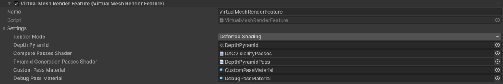
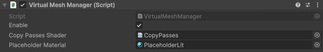
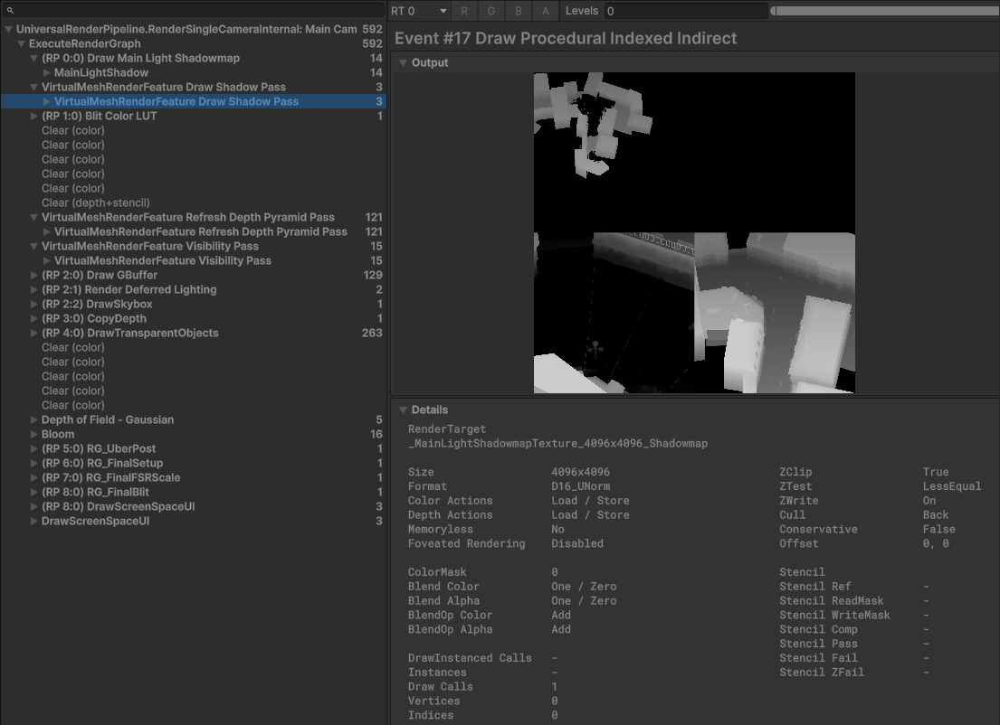
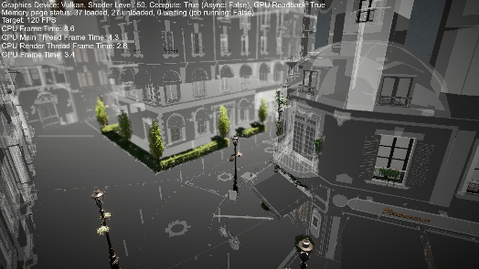
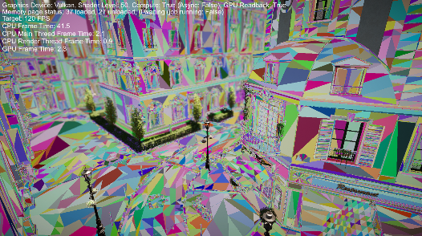

# Unity Virtual Mesh Package

This package contains the sample code referenced by the "Design and Implementation of a Lightweight Virtualized Geometry System Suitable for Mobile Use" presentation during [CEDEC 2024](https://cedec.cesa.or.jp/2024/session/detail/s66051dd5da26f/) (presentation in Japanese). The video of the presentation is available on [Unity Learning Materials](https://learning.unity3d.jp/10626/).

> [!CAUTION]
> The code contained in this package is ***not*** production-ready and only serves as a reference for implementing similar virtual geometry pipelines. You can use the code freely as long as it is tied to the Unity ecosystem (for more details see the [Unity Companion License](https://unity.com/legal/licenses/unity-companion-license)).

## Background

A typical performance issue encountered by many games is the heavy usage of CPU resources. A virtual geometry system tries to deal with this issue by moving the logic of deciding what geometry to render closer to the actual rendering itself, on the GPU. For a specific scene, all the meshes are uploaded (streamed) to the GPU and both the selection of LODs and culling of unecessary triangles are performed there right before rendering. This results in near-perfect per-material batching, LODs, and culling, all automated and without the need for tweaking assets.

This kind of system has been used in games on high-end platforms for over a decade, and now the technology and hardware present in mobile devices has caught up enough to allow us to make prototypes for other platforms as well. The goal of this package is to provide a fully customizable, C#-level implementation of a virtual geometry system that is able to showcase performance benefits even for mobile.

In order to achieve this, the virtual mesh system relies on a few concepts that we recommend understanding before diving into the package's code, including GPU instancing, compute shaders, indirect draws and dispatches, GPU-driven rendering, two-pass occlusion culling, and hierarchical level-of-details.

## Project Status

The package is currently maintained and development is still ongoing. However, we cannot make guarantees about any kind of support or the timing of updates. Here are some of the areas of focus and to-do tasks:

- ***Multiple-scene baking***: the system currently only works with a single scene for demonstration purposes, we are looking into extending the baking system to support multiple scenes.
- ***Baking UX improvements***: the baking system relies on an editor tool that we are looking into improving for better performance and usability.
- ***DX12 support***: support for DX12 requires some fixes to address the platform differences in how indirect draw arguments behave between APIs, and is currently underway.
- ***iOS support***: support work for iOS is currently underway.
- ***Performance optimizations***: there are still several ways to improve the system's runtime performance and time is continuously being spent on investigating how to improve performance.

## Setup

 

The package relies on URP, Vulkan, and the Render Graph system. Support is intended for Unity 6.3 and onwards. HDRP compatibility has not been tested.

To install the package and modify it, we recommend cloning the repository into your `Packages` folder and making sure the folder is named `com.unity.virtualmesh`. You can also import the package from the editor via the [package manager](https://docs.unity3d.com/Manual/upm-ui-actions.html).

To use the virtual mesh system, you need to follow the next few steps:

### 1. Bake virtual meshes (see Baking section)

### 2. Add a *VirtualMeshRenderFeature* to your Universal Renderer Data

When adding the new render feature, several shader and material assets should be set automatically. If this does not happen, you can refer to each field below:

- `Render Mode` should be set to the same value as defined by the Universal Renderer Data's `Rendering Path` setting
- `Depth Pyramid` should be set to *Packages/com.unity.virtualmesh/Runtime/RenderTextures/DepthPyramid.renderTexture*
- `Compute Passes Shader` should be set to *Packages/com.unity.virtualmesh/Runtime/Shaders/DXCVisibilityPasses.compute*
- `Pyramid Generation Passes Shader` should be set to *Packages/com.unity.virtualmesh/Runtime/Shaders/DepthPyramidPass.compute*
- `Custom Pass Material` should be set to *Packages/com.unity.virtualmesh/Runtime/Materials/CustomPassMaterial.mat*
- `Debug Pass Material` should be set to *Packages/com.unity.virtualmesh/Runtime/Materials/DebugPassMaterial.mat*

### 3. Add a *VirtualMeshManager* script to your main camera

The VirtualMeshManager script has several fields:

- `Enable` allows you to enable or disable virtual meshes without incurring the heavy cost of enabling or disabling the `Virtual Mesh Manager` component itself
- `Copy Passes Shader` should be set to *Packages/com.unity.virtualmesh/Runtime/Shaders/CopyPasses.compute*
- `Placeholder Material` should be set to *Packages/com.unity.virtualmesh/Runtime/Materials/PlaceholderLit.mat*

## Baking

Meshes that will be rendered via the virtual mesh system need to be pre-processed and saved as a separate set of custom files. We call this process baking, which can be done entirely in the editor. Once baked, the original mesh assets are not used anymore, and can be removed from the scene.

> [!NOTE]
> Only static opaque meshes are supported for now. Transparent objects can be baked, but the rendering order of those objects is not guaranteed.

Meshes that should be baked should be present in the scene as GameObjects, and collectively grouped under one single parent (the depth and structure of that parent's hierarchy does not matter). After grouping the objects for baking, follow the next steps:

1. Open the *Virtual Mesh Baker* window by selecting `Virtual Mesh` > `Open Baker` from the editor tabs.
2. Drag and drop your parent object into the `Root Game Object` field.
3. Check the `Bake Inactive Objects` checkbox if inactive GameObjects should be considered during baking
4. Click on the `Full Bake` button and wait until the process completes

When the baking completes, the console should display a message with some statistics about the number of objects that have been processed. There should also be two new folders in your project:

- *Assets/StreamingAssets/VirtualMeshData*, which contains the newly converted mesh data and their materials, saved into AssetBundles.
- *Assets/VirtualMeshCache*, which contains intermediate assets that are generated by the baking process and saved here for debuging.

> [!CAUTION]
> The baking system is configured to build asset bundles for the currently selected build platform. To visualize virtual meshes in the editor, make sure that you have performed a full bake with Vulkan as Graphics API and Windows selected as your active build profile.

## Technical Details

See the [Glossary](Documentation~/glossary.md) section for a list of vocabulary and concepts that are frequently used in the package.

See the [Implementation](Documentation~/implementation.md) section for details about the package's architecture and implementation details.

## Feature Support

Here is a list of Unity features that require specific care because they may not be compatible with this package by default.

| Feature | Support Status |
| --- | --- |
| Directional Light | Both lighting and shadows are supported up to 4 cascades. |
| Additional Lights | Only lighting is supported (no shadows). |
| Light Baking | Only one set of UVs is supported for lightmaps. |
| Rendering Path | Both Deferred and Forward are supported. |
| Post Effects | Post-processing effects that require prepasses that render to the GBuffer are not supported. |

## Troubleshooting

To check if the virtual system is correctly rendering objects, you can enable the Unity Frame Debugger and check if passes such as *VirtualMeshRenderFeature Draw Shadow Pass* or *VirtualMeshRenderFeature Refresh Depth Pyramid Pass* are actively drawing content for shadows and opaque geometry respectively:

The VirtualMeshRenderFeature's settings include a checkbox to activate a debug shader, called *Enable Occlusion Debug View*. This replaces the first pass of the two-pass occlusion culling algorithm with a debug shader render that relies on *Runtime/Shaders/DebugPasses.shader*, which by default renders virtual meshes with a transparent blend based on camera depth to visualize overdraw and check if culling is working:

The shader also contains commented code to switch to a triangle view to see if LOD-switching is working correctly:

## License

See [LICENSE.md](LICENSE.md).
